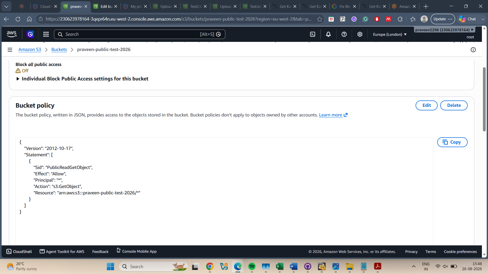
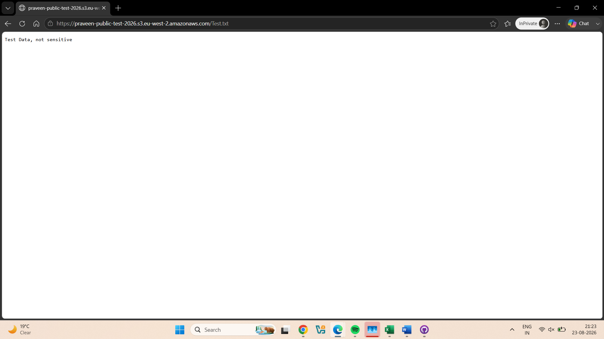
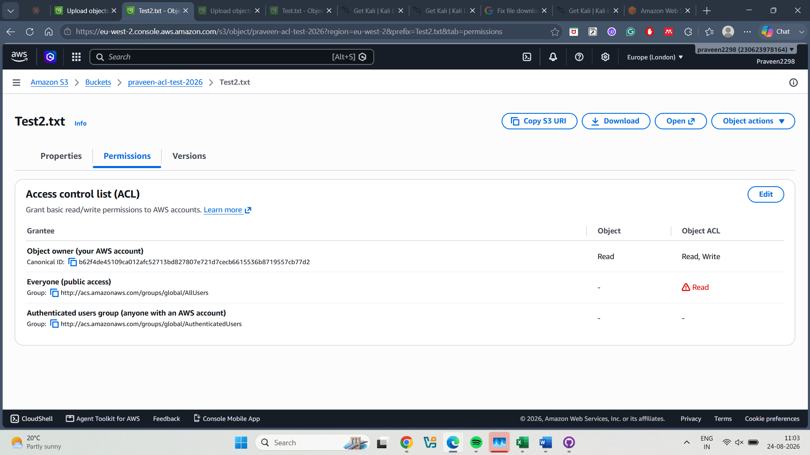
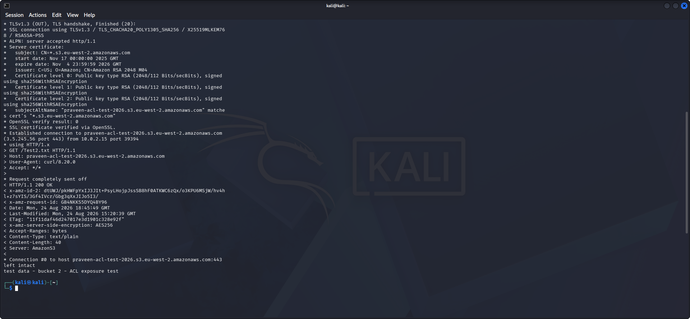
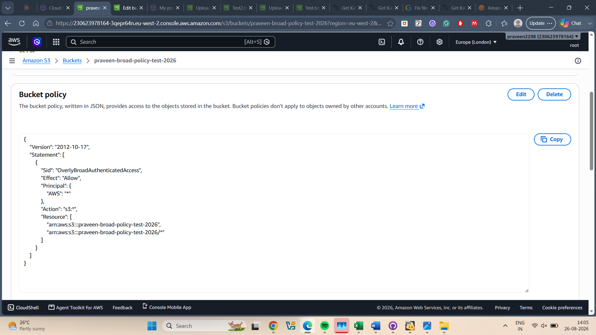
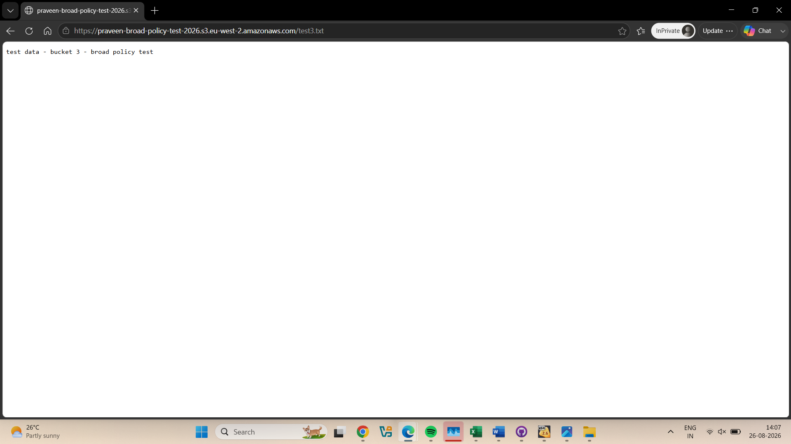
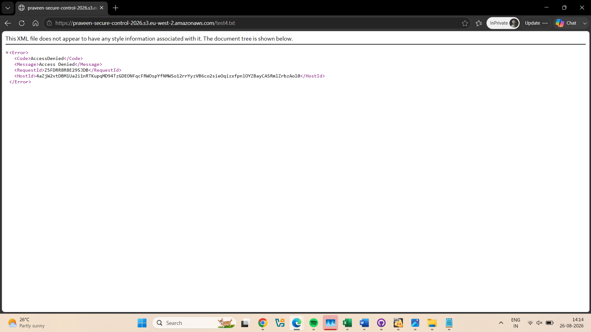
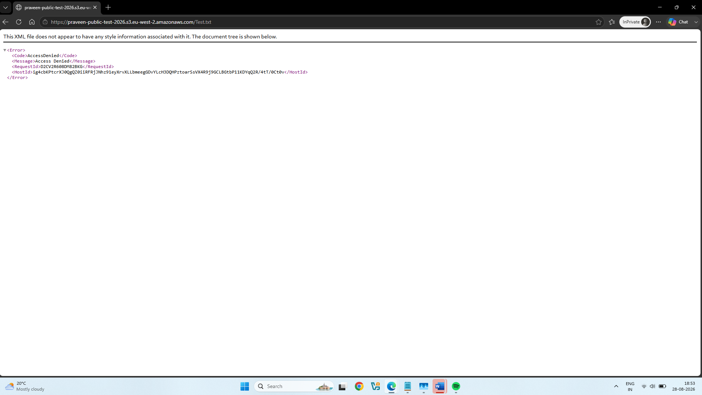
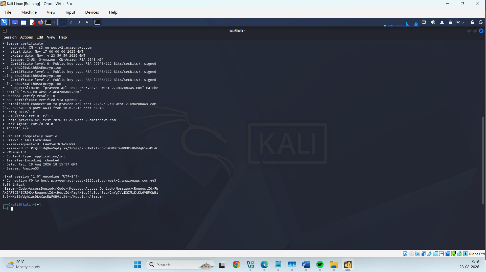
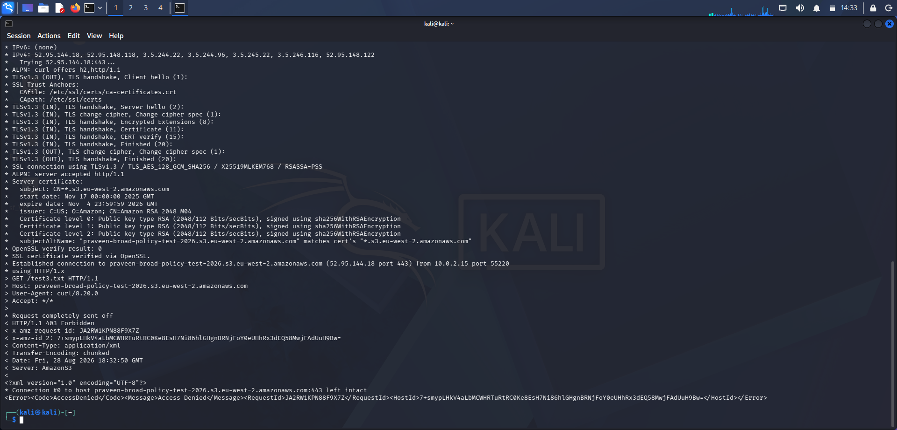

# AWS S3 Misconfiguration Audit

**Author:** Praveen Gaikwad
**Date:** August 2026
**Environment:** Personal AWS Free Tier lab (isolated, no production data)

## 1. Objective

Public S3 bucket exposure is one of the most common real-world causes of cloud data breaches. This project simulates a security audit of an AWS account: intentionally misconfiguring a set of S3 buckets in different, realistic ways, proving each exposure is actually exploitable, investigating root causes, and remediating each finding with verification.

The goal was to practice the full audit lifecycle an entry-level cloud security analyst is expected to perform: **discover → verify → investigate → remediate → confirm.**

## 2. Scope

Four S3 buckets were created in a personal AWS account, each representing a distinct real-world misconfiguration pattern:

| Bucket | Misconfiguration Type | Purpose |
|---|---|---|
| `praveen-public-test-2026` | Public read via bucket policy | Simulates the most common S3 breach pattern |
| `praveen-acl-test-2026` | Public read via object ACL | Simulates legacy/ACL-based exposure |
| `praveen-broad-policy-test-2026` | Overly broad "authenticated" policy | Simulates a partial-fix misconception |
| `praveen-secure-control-2026` | None (control bucket) | Baseline example of correct configuration |

## 3. Methodology

For each bucket, the following process was followed:
1. Apply the misconfiguration deliberately
2. Attempt unauthenticated access via browser (incognito) and `curl` to prove real-world exploitability
3. Where results were unexpected, investigate using AWS CLI (`aws s3api`) to get ground-truth configuration data, independent of the console UI
4. Cross-reference unexpected findings against official AWS documentation before concluding they were genuine
5. Remediate the misconfiguration
6. Re-test to confirm the fix was effective

## 4. Findings

### 4.1 Bucket 1 — Public Read via Bucket Policy

**Configuration:** Block Public Access disabled; bucket policy granted `s3:GetObject` to `Principal: "*"`.

```json
{
  "Version": "2012-10-17",
  "Statement": [
    {
      "Sid": "PublicReadGetObject",
      "Effect": "Allow",
      "Principal": "*",
      "Action": "s3:GetObject",
      "Resource": "arn:aws:s3:::praveen-public-test-2026/*"
    }
  ]
}
```

**Impact:** Any unauthenticated internet user could read any object in the bucket. Confirmed by loading the object URL in an incognito browser with no AWS login — file content returned successfully.

**Evidence:**


*Bucket policy granting public GetObject access*


*Object accessible via incognito browser with no AWS login*


**Risk Rating:** High

---

### 4.2 Bucket 2 — Public Read via Object ACL

**Configuration:** Block Public Access disabled at bucket level; Object Ownership set to "Bucket owner preferred" (ACLs enabled); the `AllUsers` group granted `READ` on the object directly via ACL.

**Investigation note:** Initial browser testing returned `Access Denied` despite a correctly configured ACL, no conflicting bucket policy, and Block Public Access disabled at both account and bucket level (all independently confirmed via `aws s3api get-object-acl`, `get-bucket-policy`, and `get-public-access-block`). Root cause was isolated to the browser/testing method rather than the AWS configuration — a direct `curl -v` request returned `HTTP/1.1 200 OK` and the object's content, confirming the exposure was real and the earlier browser result was not representative of the bucket's actual state.

**Evidence:**


*Object ACL granting Everyone (public access) Read permission*


*curl returning HTTP/1.1 200 OK and the object's content, confirming real exposure independent of browser caching*

**Risk Rating:** High

---

### 4.3 Bucket 3 — Overly Broad "Authenticated" Policy

**Configuration:** Bucket policy granted `s3:*` (full control) to `Principal: {"AWS": "*"}`, intended to represent "any AWS account holder" rather than the general public.

```json
{
  "Version": "2012-10-17",
  "Statement": [
    {
      "Sid": "OverlyBroadAuthenticatedAccess",
      "Effect": "Allow",
      "Principal": {"AWS": "*"},
      "Action": "s3:*",
      "Resource": [
        "arn:aws:s3:::praveen-broad-policy-test-2026",
        "arn:aws:s3:::praveen-broad-policy-test-2026/*"
      ]
    }
  ]
}
```

**Finding:** Testing showed the bucket was accessible via a plain, unauthenticated browser request and `curl` — not just by AWS-authenticated principals as the policy's wording implied. This was cross-checked against AWS's official IAM documentation ([*AWS JSON policy elements: Principal*](https://docs.aws.amazon.com/IAM/latest/UserGuide/reference_policies_elements_principal.html)), which confirms:

> "Using a wildcard (*) with an Allow effect grants access to all users, including anonymous users (public access)... We strongly recommend that you do not use a wildcard (*) in the Principal element of a resource-based policy with an Allow effect unless you intend to grant public or anonymous access."

This confirms `Principal: "*"` and `Principal: {"AWS": "*"}` are functionally equivalent for anonymous access — a subtle but important distinction, since the latter is sometimes mistakenly assumed to be more restrictive than it actually is.

**Impact:** This represents a realistic scenario where a team believes they've scoped access to "our organization only" but has actually left the bucket fully public, with full read/write/delete permissions (`s3:*`) rather than read-only.

**Evidence:**


*Policy granting s3:* to Principal: {"AWS": "*"}, with Block Public Access disabled*


*Object accessible with no AWS authentication, despite the Principal appearing to restrict access to authenticated AWS accounts*

**Risk Rating:** Critical (public + full permissions, not just read)

---

### 4.4 Bucket 4 — Secure Control

**Configuration:** Default settings; Block Public Access fully enabled; no custom bucket policy or ACL.

**Result:** Object URL correctly returned `Access Denied` for unauthenticated access, confirming this bucket represents a properly secured baseline.

**Evidence:**


*Access Denied returned for unauthenticated access, confirming correct default configuration*

**Risk Rating:** None (control example)

## 5. Remediation

| Bucket | Remediation Action | Verification |
|---|---|---|
| Bucket 1 | Removed public bucket policy; re-enabled Block Public Access | Object URL returned `Access Denied` |
| Bucket 2 | Removed public ACL grant on object; re-enabled Block Public Access | `curl` returned `403 Forbidden` |
| Bucket 3 | Replaced wildcard Principal with specific AWS Account ID; reduced Action from `s3:*` to `s3:GetObject` (least privilege); re-enabled Block Public Access | `curl` returned `403 Forbidden` |

All fixes were verified using the same testing method as the original exposure (browser/`curl`), ensuring the remediation was proven effective rather than assumed.

**Evidence:**


*Access Denied confirmed after removing the public policy*


*403 Forbidden confirmed via curl after removing the public ACL*


*403 Forbidden confirmed via curl after scoping the Principal and reducing granted Actions*

## 6. Key Takeaways

- **Block Public Access is a critical safety layer, independent of policies and ACLs.** It exists at both account and bucket level, and should generally remain enabled unless a specific, deliberate exception is needed.
- **A "restrictive-looking" Principal is not always restrictive.** `Principal: {"AWS": "*"}` is functionally equivalent to full public access for anonymous users — verified directly against AWS's own documentation rather than assumed.
- **Multiple exposure mechanisms must be checked independently.** A bucket can look secure at the policy level while still being exposed via object-level ACLs, or vice versa.
- **Console UI results should be cross-verified with the CLI when investigating unexpected behavior.** During this audit, an inconsistent browser result was resolved by using `aws s3api` and `curl` to establish ground truth — a habit directly applicable to real investigative work.
- **Least privilege applies to remediation, not just detection.** Fixing Bucket 3 involved not only scoping the Principal, but also reducing the granted Action from full control (`s3:*`) to read-only (`s3:GetObject`).

## 7. Tools Used

AWS Management Console, AWS CLI, `curl`, incognito/private browsing for unauthenticated testing.

## 8. References

- AWS IAM Documentation: [AWS JSON policy elements: Principal](https://docs.aws.amazon.com/IAM/latest/UserGuide/reference_policies_elements_principal.html) — used to verify that `Principal: "*"` and `Principal: {"AWS": "*"}` behave identically for anonymous access (referenced in Section 4.3)

---

*This audit was performed in a personal, isolated AWS Free Tier account using synthetic test data. No production systems or real customer data were involved.*
